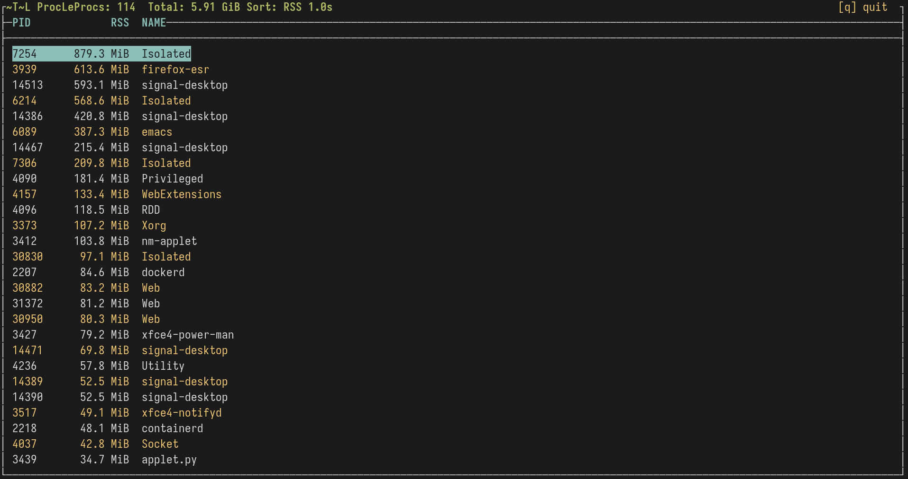

```
            ██████╗ ██████╗  ██████╗  ██████╗███████╗
            ██╔══██╗██╔══██╗██╔═══██╗██╔════╝██╔════╝
            ██████╔╝██████╔╝██║   ██║██║     █████╗
            ██╔═══╝ ██╔══██╗██║   ██║██║     ██╔══╝
            ██║     ██║  ██║╚██████╔╝╚██████╗███████╗
            ╚═╝     ╚═╝  ╚═╝ ╚═════╝  ╚═════╝╚══════╝
```

                Tiny Process Viewer
            https://github.com/Voctl/proclens
────────────────────────────────────────────────
proclens is a tiny process viewer for Linux.

It reads /proc directly and does one thing:
show you what is running — live.

No daemon.
No config files.
No dependencies beyond ncurses.
No telemetry.
No nonsense.
────────────────────────────────────────────────
FAST BY DESIGN

• first frame in ~26 ms (measured, not promised)
• ~0.4% of one core while running
• reads /proc/[pid]/stat — one small file per process,
  name + RSS + CPU ticks in a single read
• zero sscanf / zero snprintf on the hot path
• diff rendering: only changed lines touch the terminal
• pointer-based sort: moves 8-byte pointers, not structs
• skips redraws entirely when nothing changed
────────────────────────────────────────────────
FEATURES

• PID, CPU%, MEM%, RSS and name for every process
• sort by memory, pid, name or cpu usage
• live filter with /
• kill processes without leaving the keyboard
• load average in the header
• page navigation through big process lists
• CLI flags for scripts and dotfiles
────────────────────────────────────────────────
Screenshot

<p align="center">

</p>
────────────────────────────────────────────────
BUILD
```
make
./proclens
```

Or:
```
gcc -O2 -Wall -Wextra proclens.c -lncurses -o proclens
```
────────────────────────────────────────────────
USAGE
```
proclens [-d sec] [-s rss|pid|name|cpu] [-f str] [-v]

-d sec    refresh interval: 0.5, 1, 2 or 5
-s mode   initial sort order
-f str    start with a filter applied
-v        print version
```
────────────────────────────────────────────────
KEYS
```
j / ↓       down
↑           up
PgUp/PgDn   page up / page down
g / Home    jump to top
G / End     jump to end
s           cycle sorting (RSS → PID → Name → CPU)
/           filter
Esc         clear filter
+ / -       change refresh interval
?           toggle help
k           kill process (confirm with y)
q           quit
```
────────────────────────────────────────────────
WHY?
Because a process monitor doesn't need a framework,
a daemon, an account, or 400 MB of dependencies.
proclens is small, readable and free software.
Read the code.
Change it.
Break it.
Fix it.
Share it.
────────────────────────────────────────────────
LICENSE
GPLv3
Free software.
No tracking.
No cloud.
No subscription.
Just C and /proc.
